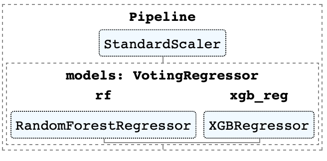
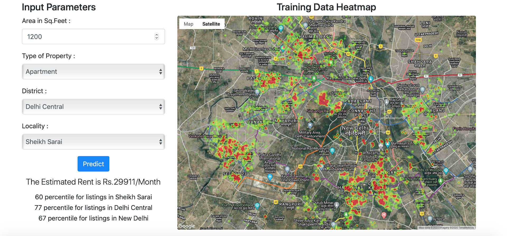

# Delhi Rental Price Prediction

Estimate the rent you should be paying for a house in New Delhi. 
Models trained on 12000 scrapped public rental listings and deployed as a Flask app. 

    
1. Data scraping and ingestion [scripts.](Scraper/) 
2. Data Cleaning and Wrangling [Notebook.](https://nbviewer.jupyter.org/github/DnanaDev/Delhi_Rental_Price_Prediction/blob/master/Data_Wrangling.ipynb)
3. **Analysis and Modelling**- Using a Voting Regressor Ensemble of Random Forest and XGBoost with one model optimised for reduced MAE and the other for reduced RMSE.\
All Feature selection (RFE), model comparisons and hyper-parameter optimisation in [Notebook.](https://nbviewer.jupyter.org/github/DnanaDev/Delhi_Rental_Price_Prediction/blob/master/Rental_Price_Analysis_and_Modeling.ipynb)
4. Deployed as a [Flask App.](https://new-delhi-rent-prediction.herokuapp.com)

Model Pipeline            |  Web-App
:-------------------------:|:-------------------------:
|
